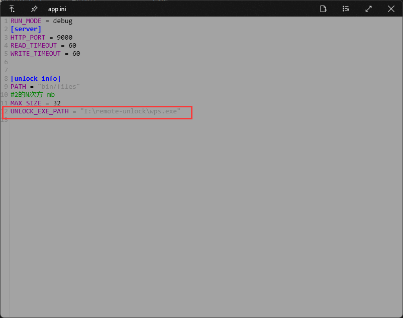
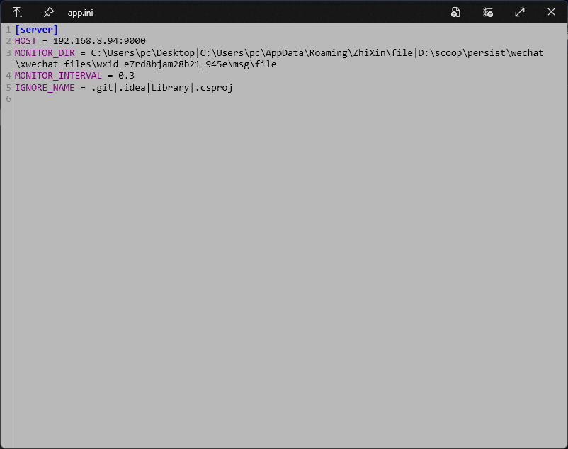

# 亿赛通远程解密
在Win11系统中，安装亿赛通应用程序后，资源管理器会频繁的崩溃重启，以及其他各种莫名奇妙的问题，为解决这些问题，需将本机的亿赛通应用程序卸载（卸载方法可参考互联网教程）  
**确保在当前的公司环境下，使用[此程序](https://github.com/zhang00lei/YiSaiTongUnlock)可以正常使用**  
**注：此工具用于在能够正常打开加密文件的情境下使用，简而言之，就是省去了解密申请的步骤。各公司亿赛通加密策略不同，本程序可能不适用于所有策略，可根据实际情况进行修改**
## 服务端部署
服务端需windows操作系统，并且安装了亿赛通应用程序。解压[亿赛通解锁.zip](https://github.com/zhang00lei/YSTRemoteUnlock/releases/tag/1.0.0)，将remote-unlock目录放置在服务端，并配置conf/app.ini中相关信息，如下：
  
然后双击启动RemoteUnlockServer.exe即可。
## 客户端  
在卸载完成的机器中，解压[亿赛通解锁.zip](https://github.com/zhang00lei/YSTRemoteUnlock/releases/tag/1.0.0)，双击安装RemoteUnlock.exe，完成后在安装位置修改conf/app.ini文件，修改对应的服务端信息
即可。
## 使用
在客户端，选中文件或目录，右键RemoteUnlock即可完成解密。

# 免责声明  
本软件的任何使用仅用于非营利性的教育和测试目的。